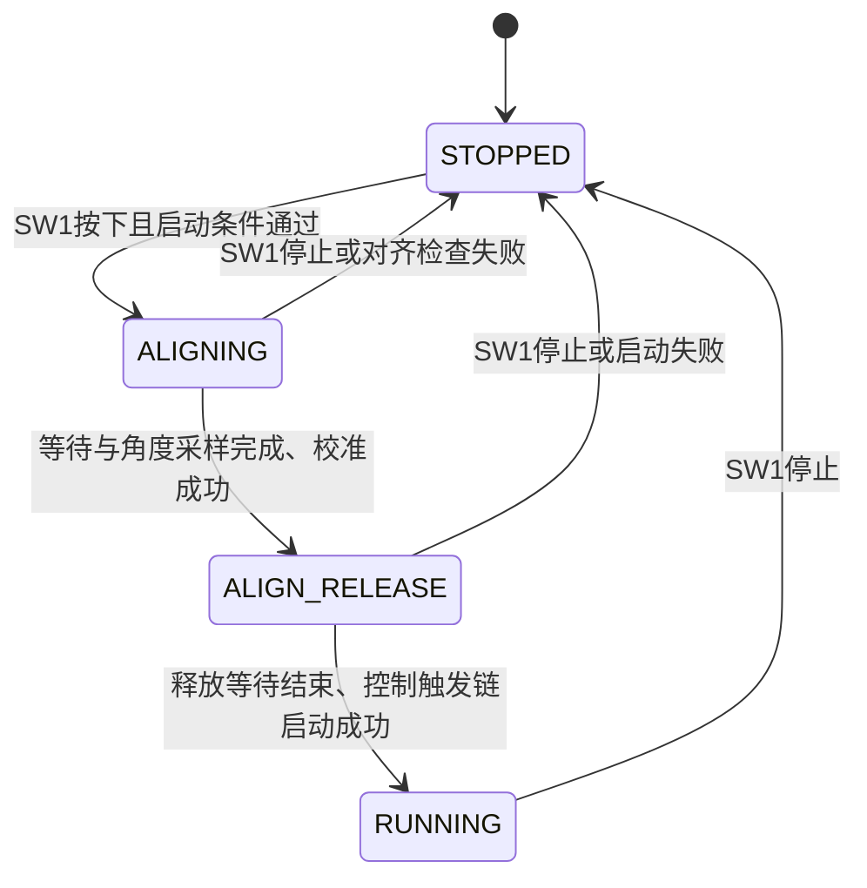

# ZqFOC 工程总体说明

本文依据 2026-10-03 的工程源码编写。工程目录名为 `ZqFOC`，CMake 项目名为 `G431_FOC_HAL`。文中的频率、阈值和操作流程对应当前实现，不代表上板测量结果。

配套文档：[FOC 模块与算法详解](02_FOC模块与算法详解.md)、[串口通信与 VOFA+ 使用指南](03_串口通信与VOFA使用指南.md)。

## 1. 工程实现了什么

这是基于 STM32G431、STM32 HAL 和增量式编码器的单电机 FOC 控制工程。它通过两相电流采样、编码器电角度反馈、电流 PI 和 SVPWM 控制三相输出，并在外层提供速度控制和单圈位置控制。

当前主要功能包括：

- 上电校准 ADC 和 A/B 相电流零偏，保持三相功率输出关闭。
- SW1 启停，启动时非阻塞执行转子对齐和编码器电角度偏置校准。
- 速度模式下，SW2/SW3 按 100rpm 步长增减带符号的目标转速。
- 正、负速度目标分别代表正转、反转，无独立方向标志位。
- 位置模式下，按单圈内最短角度误差定位。
- VOFA+ 显示八路控制变量，并通过 ASCII 命令设置模式和目标。

软件提供速度模式和位置模式。电流环是二者共同的内环，当前没有单独暴露给用户的“电流模式”。工程使用裸机主循环和中断，没有 RTOS。

## 2. 硬件配置

### 2.1 MCU 与时钟

硬件背景可参考根目录的 [开发板信息](../开发板信息.md) 和原理图 `SCH_STM32G431RBT6_BLDC_V1.3_2025-02-07.pdf`。下表以实际生成的初始化代码及 `.ioc` 为准。

| 项目 | 当前配置 | 对应来源 |
|---|---|---|
| MCU | STM32G431RBT6，Cortex-M4 | `G431_FOC_HAL.ioc` |
| Flash / RAM | 链接脚本分配 128KB / 32KB | `STM32G431XX_FLASH.ld` |
| 外部时钟 HSE | 8MHz | `stm32g4xx_hal_conf.h`、`.ioc` |
| PLL | M=2、N=85、R=2 | `SystemClock_Config()` |
| 系统时钟 | 8MHz / 2 × 85 / 2 = 170MHz | `main.c` |
| AHB、APB1、APB2 | 均不分频 | `main.c` |

### 2.2 外设与引脚

| 用途 | 外设 / 引脚 | 说明 |
|---|---|---|
| 三相主 PWM | TIM1 CH1/CH2/CH3：PA8/PA9/PA10 | PWM1 |
| 三相互补 PWM | TIM1 CH1N/CH2N/CH3N：PB13/PA12/PB15 | 用于三相半桥 |
| 电流采样触发 | TIM1 CH4 | PWM2，比较值 4950；无外部输出引脚 |
| 硬件刹车输入 | PC13，TIM1_BKIN | 低有效，滤波编码 4，自动输出恢复关闭 |
| A 相电流 | PC3，ADC1 IN9 注入组 Rank1 | TIM1_CC4 上升沿触发 |
| B 相电流 | PC4，ADC2 IN5 注入组 Rank1 | 同一 TIM1_CC4 事件触发 |
| 母线电压 | PB11，ADC1 IN14 常规组 Rank1 | 软件启动，主循环轮询 |
| 编码器 A/B | PC6/PC7，TIM3 CH1/CH2 | TI12 编码器模式 |
| 速度环节拍 | TIM6 | 1ms 定时中断，无外部引脚 |
| 启停 SW1 | PD2 | 下拉输入，按下为高 |
| 增速 SW2 | PB6 | 下拉输入，按下为高 |
| 减速 SW3 | PC9 | 下拉输入，按下为高 |
| USART2 TX/RX | PB3/PB4，AF7 | 2000000bps，8N1 |

三路 OPAMP 均配置为独立运放模式，使用工厂校准值，内部输出路径关闭：

| 运放 | 正输入 VINP | 负输入 VINM | 输出 VOUT |
|---|---|---|---|
| OPAMP1 | PA1 | PA3 | PA2 |
| OPAMP2 | PA7 | PA5 | PA6 |
| OPAMP3 | PB0 | PB2 | PB1 |

`CURRENT_AMP_GAIN=10` 是电流换算使用的硬件增益参数，不能理解成程序将 OPAMP 配置为了内部 PGA 十倍增益。当前控制软件只读取 A/B 两相电流，C 相由 `-(ia+ib)` 重构；启动三路运放不等于每次控制读取三路 ADC 电流。

### 2.3 定时器和 ADC 参数

| 外设 | 关键参数 | 作用 |
|---|---|---|
| TIM1 | PSC=0，ARR=5312，中心对齐模式1，RCR=1 | PWM 约 16kHz |
| TIM1 CH1～3 | 初始 CCR=2656 | 约 50% 占空比；初始化不等于已启动功率输出 |
| TIM1 CH4 | PWM2，CCR=4950 | 安排 ADC 注入采样时刻 |
| TIM1 死区 | `DeadTime=149` | 这是死区寄存器编码，不是“149ns” |
| TIM3 | ARR=4095，TI12，输入滤波编码12 | 单圈计数 0～4095 |
| TIM6 | PSC=169，ARR=999 | 170MHz / 170 / 1000 = 1kHz |
| ADC1/ADC2 | 12位、右对齐、独立模式 | 电流采样并非 ADC 双重同步模式 |
| ADC 注入组 | 每个 ADC 一个通道，采样时间6.5周期 | 高频电流反馈 |
| ADC1 常规组 | 采样时间47.5周期，非连续转换 | 低频母线电压反馈 |

PWM 频率按中心对齐的往返计数估算约为 `170MHz/(2×5312)`。控制算法中的 `CURRENT_LOOP_TS` 按 16kHz 定义，不能将这个配置值当作实测 ISR 周期。

### 2.4 电机与采样参数

这些是 [motor_param.h](../User/motor_param.h) 中当前使用或保存的参数。

| 参数 | 值 | 用途 |
|---|---:|---|
| 极对数 | 7 | 机械角转换为电角度 |
| 编码器每圈计数 | 4096 | 角度和转速换算；指计数结果，不直接等于编码器线数 |
| 额定 / 最大电流 | 0.5A / 2A | 最大电流用于速度 PI 输出限幅 |
| 最大 / 启动速度 | 2600rpm / 100rpm | 速度目标限幅和速度模式启动目标 |
| 按键速度步长 | 100rpm | SW2/SW3 调速 |
| 采样电阻 / 放大增益 | 0.003Ω / 10 | 电流换算 |
| ADC 参考 / 满量程 | 3.3V / 4095 | 采样换算 |
| 母线分压倍率 | 26 | 母线电压换算 |
| 占空比范围 | 0.20～0.80 | SVPWM 最终占空比限制 |
| 电压利用系数 | 0.90 | 电流环输出电压矢量限幅 |

相电阻、Ld/Lq、磁链、惯量、转矩常数也保存在头文件中；当前控制函数没有用它们在线推导 PI 参数或进行电机模型前馈。

## 3. 软件结构与对象关系

```text
ZqFOC/
├── Core/Inc、Core/Src     CubeMX外设配置、main、中断入口、运行时支持
├── User/
│   ├── foc_manager.c/.h  单电机对象、初始化、启停、对齐、低频调度
│   ├── foc_key.c/.h      按键初值、消抖、启停与带符号调速
│   ├── foc_bus_voltage.c/.h  母线电压
│   ├── foc_current.c/.h  A/B相电流与零偏校准
│   ├── foc_encoder.c/.h  编码器角度、转速、电角度偏置校准
│   ├── foc_math.c/.h     Clarke、Park、逆Park、角度归一化
│   ├── foc_pi.c/.h       通用PI
│   ├── foc_loop_cur.c/.h 电流环
│   ├── foc_loop_spd.c/.h 速度环
│   ├── foc_loop_pos.c/.h 位置环
│   ├── foc_svpwm.c/.h    调制及PWM更新
│   ├── foc_vofa.c/.h     通信、模式、目标、遥测
│   ├── foc_lib.h         公共头文件集合
│   └── motor_param.h    参数与数学常量
├── Drivers/              ST HAL和CMSIS依赖
├── cmake/                生成配置及交叉编译工具链
├── G431_FOC_HAL.ioc       CubeMX配置
└── readme/               本组说明文档
```

`foc_motor` 在 `foc_manager.c` 中唯一地定义，直接拥有 encoder、current、bus_voltage、svpwm、loop_cur、loop_spd、loop_pos 七个对象。其他文件通过头文件的 `extern` 声明访问同一个对象。

初始化时建立指针关系：电流环指向编码器、电流采样和 SVPWM；速度环指向编码器和电流环；位置环指向编码器和速度环。VOFA 保存这些成员的地址。传递地址不会再创建另一套模块对象。

`motor_state` 为 `volatile`，主循环写入、中断读取。它保证相应访问不会被编译器省略，但不等于为整个对象建立了锁，也不保证一组遥测变量是同一时刻的快照。

## 4. 上电初始化的完整顺序

`main()` 执行 `HAL_Init()`、`SystemClock_Config()`，然后依次调用：

```c
MX_GPIO_Init();
MX_DMA_Init();
MX_ADC1_Init();
MX_ADC2_Init();
MX_OPAMP1_Init();
MX_OPAMP2_Init();
MX_OPAMP3_Init();
MX_TIM1_Init();
MX_TIM3_Init();
MX_TIM6_Init();
MX_USART2_UART_Init();
FOC_Motor_Init();
```

`FOC_Motor_Init()` 再执行应用初始化：

1. 设置 `STOPPED`，清零校准有效标志和对齐时间/计数状态。
2. `FOC_KEY_Init()` 记录当前按键电平。上电一直按住的键须松开、再按才产生动作。
3. 对 ADC1、ADC2 执行单端校准，启动 OPAMP1/2/3，保留1ms稳定等待。
4. 初始化并启动 TIM3 编码器，初始化电流采样、母线采样并先测一次母线电压。
5. 初始化 SVPWM、电流环、速度环和位置环。
6. 清除三相主/互补通道的 CCER 使能位。
7. 启动 ADC2 注入组、ADC1 注入组和 TIM1 CH4，用轮询方式采集24次零电流样本。
8. 分别停止 CH4、ADC1、ADC2；三项操作都会执行。任一停止失败也将校准标记为失败。
9. 无条件关闭 MOE，根据结果设置 `current_offset_valid`。
10. 初始化 VOFA 接收，同步测速历史和非运行遥测时间戳。

ADC 校准、运放启动或 VOFA 接收启动失败会进入 `Error_Handler()`，关中断并停留在死循环。电流零偏校准失败则保留无效标志，仍允许通信和主循环工作，但 `FOC_Motor_Start()` 拒绝启动。

这里有三种不同操作：ADC 自身校准、电流传感器零偏校准、转子对齐后的编码器电角度偏置校准。前两项在上电执行，第三项在每次按键启动时执行。

## 5. 启停和非阻塞对齐状态机



### 5.1 发起启动：FOC_Motor_Start()

必须处于 `STOPPED` 且电流零偏有效。函数重新读取母线电压，电压小于等于零时返回。随后清零速度/电流目标，复位四个 PI 积分，先写入零电压对应的三相占空比，再启动三相 PWM。

只有三相主/互补通道的 CCER 位全部使能、MOE 已置位，才施加 `v_alpha=1V、v_beta=0V` 的固定方向对齐电压，并记录对齐起始时间、清零采样次数、发布 `ALIGNING`。输出检查失败会调用完整停机流程。

`FOC_Motor_Start()` 不等待整个对齐过程，不启动实时闭环。对齐阶段的电压是固定方向开环电压；此时还没有可靠的编码器电角度偏置，不能先用错误电角度运行电流 PI。

### 5.2 对齐采样：ALIGNING

主循环反复调用 `FOC_Motor_ProcessAlignment()`：

- 先检查母线电压和 MOE。无效时停机。
- 未到1000ms保持时间时直接返回。
- 超过 `1000+100=1100ms` 且采样尚未完成时停机。
- 第一个样本立即采集；后续至少间隔2ms，每次任务最多采一个机械角样本，共10个。
- 对样本做圆周平均，计算并写入电角度 offset；无效样本或平均结果检查失败时停机。
- 写入零电压，记录释放起点，进入 `ALIGN_RELEASE`。

10个样本之间有9个间隔，理想情况下约18ms；实际时间还受主循环调度影响。这里的100ms是保持时间之后的采样总窗口，不是单次采样等待时间。

### 5.3 释放等待和闭环启动：ALIGN_RELEASE

释放阶段保持 PWM 通道开启、指令电压为零，等待800ms。它没有关闭 MOE，也不等同于完整停机。控制回调仍被电机状态判断挡住。

等待结束后更新编码器角度、同步测速历史、清零速度反馈和控制目标、复位 PI，把当前机械角设为初始位置目标，并再次写零电压。按以下顺序启动：

```text
ADC2注入组
→ ADC1注入组中断
→ TIM1 CH4采样触发
→ TIM6速度环中断
→ 速度模式设置+100rpm启动目标
→ 发布RUNNING
```

任何启动步骤失败都停机。位置模式不设置100rpm，而保持刚记录的当前位置目标。成功对齐到运行通常需要约1.8秒以上，不能当作固定精确延时。

### 5.4 真正停机：FOC_Motor_Stop()

顺序为：发布 `STOPPED` → 无条件关闭 MOE → 停止 TIM6、CH4、两路注入 ADC → 停止三相主/互补 PWM → 清零速度和电流目标 → 复位 PI → 同步角度及测速历史 → 更新位置目标和零电压占空比。

关 MOE 是立即关闭高级定时器主输出；后面的逐项停止负责收尾。目标设为0只是控制目标变化，并不能替代这条停机链。

## 6. 主循环与中断如何协作

主循环始终只有应用任务调用：

```c
while (1)
{
    FOC_Motor_Task();
}
```

`FOC_Motor_Task()` 的顺序是：每10ms母线电压更新 → 按键处理 → 对齐推进 → 非 RUNNING 状态下约每10ms测速和遥测请求 → VOFA发送 → VOFA命令解析。

非阻塞对齐仅说明保持/采样/释放阶段通过时间戳推进。上电电流零偏校准使用轮询和 `HAL_Delay(2)`，母线采样也会轮询转换，不能称整个工程完全无阻塞。

| 执行位置 | 调度条件 | 周期 / 频率 | 工作 |
|---|---|---|---|
| ADC1注入完成回调 | `RUNNING` | 按PWM触发，设计16kHz | 电流采样、角度、变换、PI、SVPWM |
| TIM6回调 | `RUNNING` | 1ms / 1kHz | 速度反馈和速度PI |
| TIM6五分频 | 位置模式 | 5ms / 200Hz | 位置PI，随后本次速度PI |
| 主循环母线采样 | 时间差≥10ms | 约100Hz | 更新母线电压 |
| 主循环非运行测速 | 状态不是RUNNING | 时间差≥10ms | 停机/对齐期间的转速遥测 |

ADC及TIM1刹车中断优先级为0，TIM6为1，串口/DMA为2；数值越小，抢占优先级越高。TIM6和ADC中的算法仍直接访问 `foc_motor` 成员。

## 7. 速度与单圈位置控制

速度模式由速度 PI 输出 `iq_ref`，`id_ref` 保持0。SW2将目标加100、SW3将目标减100，目标限制在±2600rpm。负转速下按SW2会向零靠近，按SW3会增大反向速度绝对值，因此按钮的“增加/减少”指带符号目标数值。

位置模式的链路为：

```text
position_ref(rad) → 最短角度误差 → 位置PI → speed_ref(rpm)
→ 速度PI → iq_ref(A) → 电流PI → 电压矢量 → SVPWM
```

位置目标被归一化到 `[0,2π)`，误差修正到约 `[-π,π]`，例如359°到1°取+2°，而不是-358°。它不维护累计圈数，不支持多圈绝对定位。

TIM3计数在上电编码器初始化时清零，所以位置坐标相对于上电计数原点。电角度对齐校准并不是机械回零，也不会为位置环建立永久绝对零点。位置模式切入时以当前位置为目标；启动释放结束也会重新设置当前位置目标。

## 8. 当前实现边界

- “正转”对应工程约定的正目标与反馈方向，不能仅凭源码确定从某个观察方向看是顺时针还是逆时针。
- 电角度 offset 保存在 RAM，每次启动重新校准；没有写入 Flash。
- 启动/对齐检查母线是否大于零，但没有完整的软件过压、欠压状态机。
- 硬件 BKIN 可关断 PWM；当前没有专用刹车回调将电机状态同步为故障。RUNNING 回调本身也未检查 MOE。
- ADC/OPAMP初始化错误会停止程序；`Error_Handler()` 当前只关中断，没有显式执行电机停机函数。
- 母线转换未检查 HAL 启动/等待返回值，不能把旧采样值等同于有效的新电压测量。
- 软件最大电流限制作用于速度 PI 的电流目标，不等于独立的实测过流检测。
- 串口 `STOP` 是零速速度模式命令；关闭功率输出使用SW1或 `FOC_Motor_Stop()`。操作方法见第三篇。

## 9. 编译与源码阅读入口

工程使用 C11、CMake、Ninja 和 `arm-none-eabi-gcc`。工具在 PATH 可用时：

```powershell
cmake --preset Debug
cmake --build --preset Debug
cmake --preset Release
cmake --build --preset Release
```

STM32Cube工具环境也可通过项目现有的Cube CMake配置运行。最终固件位于 `build/Debug/G431_FOC_HAL.elf` 或 `build/Release/G431_FOC_HAL.elf`。

源码入口：[main.c](../Core/Src/main.c)、[manager](../User/foc_manager.c)、[按键](../User/foc_key.c)、[定时器](../Core/Src/tim.c)、[ADC](../Core/Src/adc.c)。理解初始化和状态机后，再按第二篇沿传感器→三环→PWM路径阅读。
