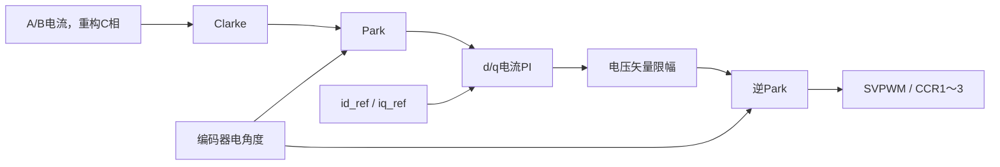

# FOC 模块、函数与算法详解

本文对应 2026-10-03 的当前源码，重点解释 `User` 中除 `foc_vofa.c/.h` 外的全部模块，并说明 `Core` 自有和生成文件的职责。`Drivers` 中 ST HAL、CMSIS 和附带示例属于供应商依赖，不逐个展开其中的库函数。VOFA 模块及串口细节见 [第三篇](03_串口通信与VOFA使用指南.md)，硬件和状态机总览见 [第一篇](01_工程总体说明.md)。

## 1. 阅读代码前先统一单位和坐标系

| 变量类别 | 单位 / 范围 | 示例 |
|---|---|---|
| ADC原始值 | 计数，12位0～4095 | `raw_a`、`bus_voltage.raw` |
| 编码器计数 | 每机械圈4096个计数 | `count`、`spd_last_count` |
| 机械角、电角度 | rad，归一化后 `[0,2π)` | `angle_m`、`angle_e` |
| 机械转速 | rpm，带符号 | `speed`、`speed_ref` |
| 电流 | A，带符号 | `i_a`、`i_d`、`iq_ref` |
| 电压 | V | `voltage`、`v_d`、`v_alpha` |
| 控制周期dt | s | 电流环0.0000625、速度环0.001、位置环0.005 |
| HAL时间戳 | ms，`uint32_t` | `HAL_GetTick()` |
| PWM占空比 | 0～1的比例 | `duty_u` |

FOC使用三组坐标：三相 `abc`、固定的 `αβ`、随转子电角度旋转的 `dq`。d轴和q轴的方向由当前Park公式定义，不能随意交换相电流或改变反馈符号而仍认为模型不变。

## 2. 母线电压：foc_bus_voltage.c/.h

源码：[实现](../User/foc_bus_voltage.c)、[接口与结构体](../User/foc_bus_voltage.h)。

`FOC_BUS_VOLTAGE_HandleTypeDef` 保存 ADC句柄指针、原始计数 `raw` 和 `volatile float voltage`。母线常规组和A相注入组共用ADC1，但通道和触发方式不同。

| 函数 | 具体作用 | 调用位置 |
|---|---|---|
| `FOC_BUS_VOLTAGE_Init()` | 绑定ADC句柄，清零原始值和电压 | manager初始化 |
| `FOC_BUS_VOLTAGE_Update()` | 软件启动常规转换，轮询最多1ms，读ADC值并换算母线电压 | 初始化、发起启动、主循环每10ms |

实际通道是ADC1 IN14/PB11。执行顺序为：

```c
HAL_ADC_Start(bus->hadc);
HAL_ADC_PollForConversion(bus->hadc, 1);
bus->raw = (uint16_t)HAL_ADC_GetValue(bus->hadc);
bus->voltage = bus->raw * (3.3f / 4095.0f) * 26.0f;
```

换算过程：ADC值先换成引脚电压，再乘硬件分压倍率。

```text
Vpin = raw × Vref / ADC_full_scale
Vbus = Vpin × BUS_VOLTAGE_DIVIDER_RATIO
```

例如 `raw=2048` 时，计算值约42.91V。3.3V、4095、26来自参数头文件，不是运行时自动测得的校准参数。

转换后不调用 `HAL_ADC_Stop()`，以保留ADC运行状态供注入组使用。此函数在主循环执行，会短暂等待，不能放入16kHz电流回调。当前没有检查启动/轮询返回值，也没有滤波或软件过欠压判定；`voltage` 只是最新一次程序写入的测量结果。

## 3. 电流采样与零偏：foc_current.c/.h

源码：[实现](../User/foc_current.c)、[接口](../User/foc_current.h)。结构体保存ADC1/ADC2指针、A/B原始值、A/B浮点零偏和三相电流。

| 函数 | 具体作用 |
|---|---|
| `FOC_CURRENT_Init()` | 绑定两路ADC，加载默认A/B零偏，清零电流 |
| `FOC_CURRENT_Update()` | 读两路注入Rank1结果，换算A/B电流，重构C相 |
| `FOC_CURRENT_CalibrateOffset()` | 功率通道关闭时轮询新注入结果，采集24组均值作为A/B运行零偏 |

### 3.1 采样触发链

```text
TIM1 CH4比较事件上升沿
→ ADC1注入IN9（A相）和ADC2注入IN5（B相）转换
→ ADC1_2_IRQHandler()
→ HAL_ADC_IRQHandler()
→ ADC1的HAL_ADCEx_InjectedConvCpltCallback()
→ FOC_LOOP_CUR_Update()
→ FOC_CURRENT_Update()
```

同一事件触发两路ADC，代码使用独立ADC模式；它没有配置双ADC注入同步模式，也没有在每次电流更新中单独等待ADC2完成。

读取 `HAL_ADCEx_InjectedGetValue()` 只是读取已经完成转换的结果，不是在该函数里再次启动采样。ADC1回调才负责调度一次电流环。

### 3.2 电流换算和C相重构

```text
CURRENT_SCALE = 3.3 / (4095 × 0.003 × 10)
              ≈ 0.026862 A/计数

ia = (offset_a - raw_a) × CURRENT_SCALE
ib = (offset_b - raw_b) × CURRENT_SCALE
ic = -(ia + ib)
```

这里特意使用 `offset-raw`；它是当前接线和模拟链路采用的电流符号约定，不能在解释时写成相反的 `raw-offset`。

例：A相零偏2030.5、采样2000，则 `ia≈0.8193A`。零电流并不意味着ADC读数为0，因为模拟电路带中点偏置。

C相重构使用 `ia+ib+ic=0` 的三相电流关系。当前没有读取独立C相ADC结果；参数中的 `ADC_CURRENT_OFFSET_C` 也没有参与这条换算路径。

### 3.3 零偏校准的操作和失败条件

`FOC_CURRENT_CalibrateOffset()` 首先检查对象、定时器、ADC指针以及三相主/互补通道CCER位。若功率通道仍使能，返回 `HAL_ERROR`。

manager在调用它前已经关闭三相通道，并启动两路注入ADC及CH4触发。校准函数清掉旧JEOC/JEOS标志，然后循环24次：

1. 等待ADC1和ADC2的JEOS均有效；单次等待到5ms还未完成则返回 `HAL_TIMEOUT`。
2. 读本次A/B原始计数并累加。
3. 清除两路完成标志。
4. `HAL_Delay(2)` 后进入下一次采样。

成功后分别将累加值除24写入 `offset_a/offset_b`。默认零偏2030.5和2019.0会被运行时校准结果覆盖。

这是上电阶段的阻塞校准。24次固定延时本身约48ms，不能称为16kHz连续平均24点，也不能把5ms误认为所有24次校准的总超时。失败时manager禁用后续启动条件，而不是带着默认偏置继续启动。

## 4. 编码器：foc_encoder.c/.h

源码：[实现](../User/foc_encoder.c)、[接口](../User/foc_encoder.h)。

`FOC_ENCODER_HandleTypeDef` 包含定时器指针、计数、机械角、电角度、电角度offset、速度和测速历史。`count` 和 `spd_last_count` 使用有符号32位变量参与差值计算。

| 函数 | 具体作用 |
|---|---|
| `FOC_ENCODER_Init()` | 绑定TIM3，清零软件量和定时器计数，加载默认offset，启动编码器模式 |
| `FOC_ENCODER_UpdateAngle()` | 读当前计数并计算机械角、电角度 |
| `FOC_ENCODER_UpdateSpeed()` | 计算计数差，修正回绕，以dt换算带符号rpm并更新测速历史 |
| `FOC_ENCODER_SetElectricalOffset()` | 将offset归一化后保存 |
| `FOC_ENCODER_CalibrateElectricalOffset()` | 单点计算offset，并同步角度、测速历史、清零速度；当前启动流程不使用该单点接口 |
| `FOC_ENCODER_CalibrateElectricalOffsetSamples()` | 对机械角数组做圆周平均，检查样本有效性，计算offset并更新角度；当前启动流程使用此接口 |

### 4.1 定时器怎样变成角度

TIM3用PC6/PC7接收A/B正交信号，TI12模式完成计数及方向识别，ARR为4095。`ENCODER_CPR=4096` 必须与一圈实际计数一致；它不是未经倍频的编码器标称脉冲数。

```text
theta_m = count × 2π / 4096
theta_e = normalize(theta_m × 7 + offset)
```

机械一圈对应七个电角度周期。机械角用于位置控制，电角度用于Park和逆Park。`FOC_ENCODER_UpdateAngle()` 不计算速度；测速接口也不直接更新 `angle_m`，二者有独立的更新职责。

### 4.2 转速计算与计数回绕

```text
delta = count_now - spd_last_count
若 delta > 2048：delta -= 4096
若 delta < -2048：delta += 4096
rpm = delta × 60 / (4096 × dt)
```

例如上一计数4090、当前4，原始差值-4086，回绕修正后为+10。若dt=1ms，速度约+146.48rpm。反向从4到4090时，修正差值为-10，反馈为负值。

dt≤0时函数写速度0；每次调用都会更新 `spd_last_count`。速度环传入1ms；非RUNNING主循环传入实际时间差换算的秒数。

这个算法假设两次测速之间实际位移小于半圈，否则无法区分方向和跨过的圈数。它是简单差分测速，没有低通滤波；1ms内一个计数对应约14.65rpm，低速时会有量化台阶。`UpdateSpeed()` 中的 `dt` 不能直接传HAL毫秒值。

### 4.3 电角度offset为什么要校准

编码器上电计数零点不一定对应转子的电角度零点。固定α轴对齐电压将转子拉到已知磁场方向，程序采集此时机械角，再计算：

```text
offset = align_angle - theta_m_aligned × MOTOR_POLE_PAIRS
```

当前 `align_angle=0`。设置offset后，转子对齐位置的电角度应接近目标对齐角，而不是任意的上电计数角。

多点校准函数使用：

```text
sum_sin = Σ sin(theta_m[i])
sum_cos = Σ cos(theta_m[i])
theta_m_avg = normalize(atan2(sum_sin, sum_cos))
offset = normalize(align_angle - theta_m_avg × 7)
```

359°和1°的普通均值为180°，圆周均值则接近0°。这就是不能对环绕角度直接求算术平均的原因。

函数拒绝空指针、零样本数、非有限角度；若 `sum_sin²+sum_cos²<1` 也失败。该检查用于排除合成方向不明确的样本，但不是完整的转子稳定性/噪声方差检测。

多点接口只同步角度，不自动清零测速历史；当前manager在释放等待结束后专门同步历史并清零反馈。offset仅保存在RAM，不持久化。

## 5. 坐标变换：foc_math.c/.h

源码：[实现](../User/foc_math.c)、[接口和返回结构](../User/foc_math.h)。三个结果结构分别保存αβ电流、dq电流、αβ电压。

| 函数 | 作用与公式 |
|---|---|
| `FOC_MATH_Clarke()` | `i_alpha=ia`；`i_beta=(ia+2ib)/√3`；保留ic参数但不使用它 |
| `FOC_MATH_Park()` | 以电角度θ把固定αβ电流转换为dq |
| `FOC_MATH_InvPark()` | 以相同电角度把dq电压转换回αβ |
| `FOC_MATH_Normalize()` | 循环加减2π，将有限角度映射到 `[0,2π)` |

Park与逆Park的具体符号为：

```text
id =  i_alpha cosθ + i_beta sinθ
iq = -i_alpha sinθ + i_beta cosθ

v_alpha = vd cosθ - vq sinθ
v_beta  = vd sinθ + vq cosθ
```

正反转由带符号速度误差、iq指令和连续编码器角度共同完成，不需要为负转速人为交换PWM相序，也不需要另外翻转Park角度。

角度归一化函数按循环实现，没有非有限输入保护。串口位置命令在进入位置接口前会检查有限性并先取余；直接在其他代码中调用位置接口时也应传入合理的有限角度。

## 6. 通用 PI：foc_pi.c/.h

源码：[实现](../User/foc_pi.c)、[接口](../User/foc_pi.h)。结构体保存kp、ki、积分项和输出上下界。

| 函数 | 具体作用 |
|---|---|
| `FOC_PI_Init()` | 设置kp/ki和上下界，积分项置0 |
| `FOC_PI_Update()` | 计算误差、离散积分、积分限幅及最终输出限幅 |
| `FOC_PI_Reset()` | 只清零积分项，不改变kp、ki或上下界 |

每次更新执行：

```text
error = reference - feedback
integral = clamp(integral + ki × error × dt, output_min, output_max)
output = clamp(kp × error + integral, output_min, output_max)
```

这是PI而非PID，没有微分项。ki是需要再乘dt的增益，不能在外面把ki预乘一次dt后仍照此调用。

当前的抗积分累积方法是积分项限幅，没有反算式抗饱和，也没有根据后续SVPWM饱和回写积分。位置环ki=0且初始化积分为0，所以当前位置环实际主要是比例控制。

| 环路 | kp | ki | PI输出范围 | 输出单位 |
|---|---:|---:|---|---|
| d电流环 | 2.70 | 8000 | ±24 | V |
| q电流环 | 2.70 | 8000 | ±24 | V |
| 速度环 | 0.0008 | 0.035 | ±2 | A |
| 位置环 | 120 | 0 | ±2600 | rpm |

## 7. 电流环：foc_loop_cur.c/.h

源码：[实现](../User/foc_loop_cur.c)、[接口与工作量](../User/foc_loop_cur.h)。结构体除了三个模块指针，还保存d/q PI、目标电流、变换后的电流、dq电压及αβ电压。

| 函数 | 具体作用 |
|---|---|
| `FOC_LOOP_CUR_Init()` | 绑定编码器、电流和SVPWM，清零工作量，建立d/q PI |
| `FOC_LOOP_CUR_SetReference()` | 写入id_ref和iq_ref，本身不做电流限幅或PI重置 |
| `FOC_LOOP_CUR_Update()` | 完成一次采样、角度读取、变换、电流PI、电压限制、逆变换和PWM更新 |

更新链为：



两路PI先分别限制在±24V，然后按实测母线电压限制矢量：

```text
Vlimit = 0.90 × Vbus / √3
Vmag = sqrt(vd² + vq²)
若 Vmag > Vlimit：
    scale = Vlimit / Vmag
    vd *= scale
    vq *= scale
```

这保持输出矢量方向、缩小幅值。随后逆Park生成αβ电压并调用SVPWM。24V的轴向PI限制和母线相关的矢量限制是两个不同层次；后者也没有回写PI积分。

当前电流环没有dq交叉耦合补偿、反电势前馈或弱磁逻辑。母线值由主循环更新并被中断读取，电流环不会每62.5μs重新测母线。

## 8. 速度环：foc_loop_spd.c/.h

源码：[实现](../User/foc_loop_spd.c)、[接口](../User/foc_loop_spd.h)。结构体保存编码器/电流环指针、速度PI、速度目标和反馈、输出iq_ref。

| 函数 | 具体作用 |
|---|---|
| `FOC_LOOP_SPD_Init()` | 绑定对象，清零速度量，初始化输出±2A的PI |
| `FOC_LOOP_SPD_SetSpeedRef()` | 将目标限制在±2600rpm后直接写入；不取绝对值，不需要方向标志 |
| `FOC_LOOP_SPD_Update()` | 按dt更新编码器速度、运行速度PI，然后向电流环设置id=0、iq=PI输出 |

```text
speed_ref - speed_fbk → 速度PI → iq_ref
FOC_LOOP_CUR_SetReference(loop_cur, 0, iq_ref)
```

正目标要求正向速度，负目标要求反向速度。例如：

```c
FOC_LOOP_SPD_SetSpeedRef(&foc_motor.loop_spd, -500.0f);
```

设置的是-500rpm目标。实际转子从正转变为反转的过程由闭环跟踪完成，并不是写入目标的瞬间机械方向就改变。代码没有专门的目标斜坡或“先等零速再切反向”状态机。

速度环由TIM6每1ms运行。位置模式下，位置环提供它的目标；速度模式下，按键/串口直接提供目标。目标0仍可能输出制动或保持零速所需的iq，不等于关闭PWM。

## 9. 位置环：foc_loop_pos.c/.h

源码：[实现](../User/foc_loop_pos.c)、[接口](../User/foc_loop_pos.h)。结构体保存位置PI、编码器/速度环指针、位置目标与反馈以及输出转速。

| 函数 | 具体作用 |
|---|---|
| `FOC_LOOP_POS_Init()` | 建立输出±2600rpm的PI并绑定对象 |
| `FOC_LOOP_POS_SetPositionRef()` | 将目标机械角归一化到 `[0,2π)` |
| `FOC_LOOP_POS_Update()` | 读取缓存机械角、修正最短路径误差、运行位置PI并设置速度目标 |

```text
error = position_ref - angle_m
若 error > π：error -= 2π
若 error < -π：error += 2π
speed_ref = PI(error, 0, dt)
```

这里先自行计算修正误差，再把它作为PI的reference、把0作为feedback，因此PI内部仍得到相同误差。

例如目标1°、当前位置359°，修正后为+2°。当前位置1°、目标359°时为-2°。当前不累计圈数，所以命令2π与0表示同一个单圈目标。

位置函数读取 `encoder->angle_m` 缓存，没有在函数内再次读硬件计数；运行时电流环不断更新该角度。TIM6每五次先运行位置环，再运行本次速度环。初始位置目标、切入位置模式的目标和停机目标由上层设置，不能把它们误解成永久机械零点。

## 10. 三环为何采用不同周期

| 环路 | 周期 | 直接输入 | 直接输出 |
|---|---:|---|---|
| 电流环 | 62.5μs，设计16kHz | id/iq目标、采样、电角度、母线 | PWM电压指令 |
| 速度环 | 1ms，1kHz | rpm目标、编码器速度 | iq目标 |
| 位置环 | 5ms，200Hz | rad目标、机械角 | rpm目标 |

电流变化快，因此内环最快；外环产生内环目标，按较慢节拍更新。三环不是同时分别直接写PWM，只有电流环最终调用SVPWM。速度模式用速度环+电流环；位置模式再增加外层位置环。

“执行频率”不等于已经测得的控制带宽，实际带宽还取决于增益、电机、采样和延时。当前参数表说明的是程序配置。

## 11. SVPWM：foc_svpwm.c/.h

源码：[实现](../User/foc_svpwm.c)、[接口](../User/foc_svpwm.h)。结构体保存TIM1指针和三相占空比。

| 函数 | 具体作用 |
|---|---|
| `FOC_SVPWM_Init()` | 绑定定时器，软件占空比初值设0.5；不启动输出，也不在此函数内写CCR |
| `FOC_SVPWM_Start()` | 启动三个主PWM和三个互补PWM；无返回值，manager另检查CCER/MOE |
| `FOC_SVPWM_Update()` | 根据αβ电压、母线和ARR计算并写三相CCR；Vbus≤0时直接返回，不自行停机 |

当前使用三相电压的最大/最小值注入公共偏置实现调制，没有显式计算六个扇区和T1/T2驻留时间。

### 11.1 αβ电压转换为三相电压

```text
vu = v_alpha
vv = -0.5 × v_alpha + (√3/2) × v_beta
vw = -0.5 × v_alpha - (√3/2) × v_beta
```

### 11.2 注入公共偏置

```text
vmax = max(vu, vv, vw)
vmin = min(vu, vv, vw)
voffset = -(vmax + vmin)/2
vu += voffset; vv += voffset; vw += voffset
```

三个相电压同时加同一个值，所以相间电压差保持不变，极值则在可用范围内居中。这是当前SVPWM实现的核心。

### 11.3 占空比与比较寄存器

```text
du = clamp(0.5 + vu/Vbus, 0.20, 0.80)
dv = clamp(0.5 + vv/Vbus, 0.20, 0.80)
dw = clamp(0.5 + vw/Vbus, 0.20, 0.80)
CCR1 = (uint32_t)(du × ARR)
CCR2 = (uint32_t)(dv × ARR)
CCR3 = (uint32_t)(dw × ARR)
```

例如 `v_alpha=1V、v_beta=0、Vbus=24V`：原始三相电压为1、-0.5、-0.5；偏置为-0.25；最终相电压为0.75、-0.75、-0.75。占空比约0.53125、0.46875、0.46875。在ARR=5312时，整数CCR约2822、2490、2490。

αβ电压为0时三相占空比均为0.5，理想平均线电压为0；这与MOE关闭有本质区别，前者仍可能有PWM开关动作。占空比限制可能再次改变已限幅的电压指令。死区和硬件刹车由 `tim.c` 配置，调制函数不负责配置这些寄存器，也没有死区电压补偿算法。

## 12. 流程管理：foc_manager.c/.h

源码：[实现](../User/foc_manager.c)、[对象与接口](../User/foc_manager.h)。

| 函数 | 具体作用 | 可见性 |
|---|---|---|
| `FOC_Motor_Init()` | 一次性应用初始化、零偏校准、通信初始化 | 公开 |
| `FOC_Motor_Start()` | 检查条件并发起固定电压对齐 | 公开 |
| `FOC_Motor_Stop()` | 关闭功率及触发链、清目标和积分、同步历史 | 公开 |
| `FOC_Motor_Task()` | 低频采样、按键、状态推进、非运行测速和通信调度 | 公开 |
| `FOC_Motor_ProcessAlignment()` | 分时等待、采样、offset校准、释放、启动闭环 | `static` |

头文件定义四个状态和直接拥有七个模块成员的 `FOC_Motor_HandleTypeDef`。定义只有一个 `foc_motor`，`.h` 的 `extern` 不是新的对象定义。

manager私有变量包括零偏有效标志、母线/遥测时间戳、对齐/采样/释放时间戳、角度数组和采样计数。它们不暴露给按键模块。启动有效性由 `FOC_Motor_Start()` 检查，按键只调用该接口。

初始化顺序、1000ms保持、10点/2ms采样、100ms采样窗口、800ms释放以及停机顺序详见 [第一篇](01_工程总体说明.md)。

## 13. 按键：foc_key.c/.h

源码：[实现](../User/foc_key.c)、[接口](../User/foc_key.h)。三个键由GPIO下拉、高有效，不使用外部中断。引脚宏、消抖结构和历史状态均只在 `.c` 内部保存。

| 函数 | 具体作用 | 可见性 |
|---|---|---|
| `FOC_KEY_Init()` | 记录初始原始/稳定电平及时间戳 | 公开，manager初始化调用 |
| `FOC_KEY_Task()` | 先处理启停，再处理带符号调速 | 公开，manager主循环调用 |
| `FOC_KEY_ProcessButton()` | SW1消抖后的高电平变化沿触发启动或停止 | `static` |
| `FOC_KEY_SpeedButtonPressed()` | 对某个调速键消抖，返回本次是否有按下事件 | `static` |
| `FOC_KEY_ProcessSpeedButtons()` | 读取SW2/SW3事件，检查模式/状态，再修改目标 | `static` |

### 13.1 消抖为什么有三个历史量

`last_level` 是最近读到的原始电平，`stable_level` 是已经接受的稳定电平，`last_change_tick` 是原始电平最后一次变化的时间。

```text
读电平level和时间now
若level不同于last_level：
    更新last_level，记录last_change_tick=now
若level不同于stable_level且距最近变化≥30ms：
    更新stable_level
    若新的稳定电平为高，产生一次按下事件
```

以按键抖动为例：0ms读到高，5ms又低，12ms又高；稳定判定从12ms重新计时，最早42ms接受按下。按住后电平不再变化，所以不会持续重复触发。松开也需要通过同样的消抖，随后再按才有新事件。

时间判断使用 `(uint32_t)(now-last_change_tick)`，在这种短时间间隔内可正确跨越HAL计数回绕。过程没有阻塞延时，不会为消抖暂停整个主循环。

### 13.2 启停与调速的实际语义

SW1在STOPPED时调用Start；其他状态下调用Stop，因此对齐和释放期间也可取消启动。

SW2/SW3只有RUNNING且速度模式时修改目标。即使模式不允许调速，程序仍更新按键消抖状态，不会把按住的键排队到未来模式中再执行。

```text
SW2：speed_ref += 100rpm
SW3：speed_ref -= 100rpm
```

例如连续按SW3：`+100 → 0 → -100 → -200`。当前不取绝对值、不限制减速最低为0，也不保存独立方向标志。正负限幅统一由速度目标设置函数完成。

若本次两键都没有事件，或者两键都产生按下事件，`speed_up==speed_down`，本次不调整。没有组合键反转功能。若两键先后按下、分别经过消抖，则仍可能按两次单键事件处理，不能把它理解成任意时间内两键按住都被屏蔽。

## 14. 参数和公共头文件

### motor_param.h

只定义宏，没有运行函数。电机、采样系数、PI增益、控制周期、速度/电流限制、占空比和对齐参数在这里集中维护。`CURRENT_LOOP_TS`、`SPEED_LOOP_TS`、`POSITION_LOOP_TS` 以秒为单位。

`ADC_CURRENT_OFFSET_C`、额定电流和若干物理电机参数目前并未直接参与在线控制计算。判断参数是否生效，应查看具体使用处，不能仅凭头文件存在推断它已经参与算法。

### foc_lib.h

它是头文件集合，包含采样、变换、PI、三环、SVPWM和VOFA接口；没有对象定义、函数实现或 `.c` 配对文件。manager和key在需要处显式包含各自头文件。

普通模块 `.h` 定义数据结构和函数声明，`.c` 给出实现。控制环中的指针成员是对象之间的关联，不是另外复制的控制器。`static` 限制私有函数/变量的链接可见性，不表示它们只执行一次。

## 15. Core目录文件与函数职责

### 15.1 程序入口和生成的外设配置

| 文件 | 函数 / 定义 | 作用 |
|---|---|---|
| `main.c` | `main()` | HAL、时钟、MX初始化、Motor_Init及循环Motor_Task |
| `main.c` | `SystemClock_Config()` | 配置HSE、PLL、170MHz总线时钟 |
| `main.c` | `HAL_TIM_PeriodElapsedCallback()` | 过滤TIM6和RUNNING；位置五分频后执行速度环 |
| `main.c` | `HAL_ADCEx_InjectedConvCpltCallback()` | 过滤ADC1和RUNNING；执行电流环并四分频请求遥测 |
| `main.c` | `Error_Handler()` | 关中断并死循环；没有显式关MOE |
| `main.c` | `assert_failed()` | 仅USE_FULL_ASSERT启用时存在，目前是空的用户处理区 |
| `main.h` | HAL包含、`Error_Handler()`声明 | 当前没有FOC对象定义或自定义引脚宏 |
| `gpio.c/.h` | `MX_GPIO_Init()` | GPIO端口时钟和三个按键下拉输入 |
| `adc.c/.h` | `MX_ADC1_Init()`、`MX_ADC2_Init()` | 常规/注入通道、触发、分辨率等配置；导出hadc1/2 |
| `adc.c` | `HAL_ADC_MspInit()`、`HAL_ADC_MspDeInit()` | ADC共用时钟计数、模拟引脚和共享中断配置/释放 |
| `opamp.c/.h` | `MX_OPAMP1_Init()`、`MX_OPAMP2_Init()`、`MX_OPAMP3_Init()` | 三路独立运放配置；真正启动在manager |
| `opamp.c` | `HAL_OPAMP_MspInit()`、`HAL_OPAMP_MspDeInit()` | 运放模拟引脚配置/释放 |
| `tim.c/.h` | `MX_TIM1_Init()`、`MX_TIM3_Init()`、`MX_TIM6_Init()` | PWM/刹车/死区、编码器、速度节拍；导出htim1/3/6 |
| `tim.c` | `HAL_TIM_PWM_MspInit()`、`HAL_TIM_Encoder_MspInit()`、`HAL_TIM_Base_MspInit()` | 相应定时器时钟、BKIN/编码器引脚和中断 |
| `tim.c` | `HAL_TIM_MspPostInit()` | 配置TIM1六路PWM输出引脚 |
| `tim.c` | `HAL_TIM_PWM_MspDeInit()`、`HAL_TIM_Encoder_MspDeInit()`、`HAL_TIM_Base_MspDeInit()` | 释放相应时钟、引脚、中断 |
| `dma.c/.h` | `MX_DMA_Init()` | DMAMUX/DMA1时钟和两个DMA中断 |
| `usart.c/.h` | `MX_USART2_UART_Init()` | USART2的2Mbps、8N1、收发配置 |
| `usart.c` | `HAL_UART_MspInit()`、`HAL_UART_MspDeInit()` | 串口引脚、时钟、TX/RX DMA关联、中断及释放 |
| `stm32g4xx_hal_msp.c` | `HAL_MspInit()` | SYSCFG/PWR基础时钟、禁用UCPD相关默认下拉 |
| `stm32g4xx_hal_conf.h` | HAL模块开关、振荡器值等 | 决定工程启用哪些HAL模块及HSE=8MHz等常量 |

“MX配置完成”和“外设开始执行应用工作”要分开理解。例如TIM1初始化之后不等于电机已经出力，TIM6初始化之后也不等于速度中断已经运行。

### 15.2 中断入口：stm32g4xx_it.c/.h

| 入口 | 转交对象 / 实际作用 |
|---|---|
| `ADC1_2_IRQHandler()` | 依次调用两路ADC的HAL处理器，再由HAL进入注入回调 |
| `TIM6_DAC_IRQHandler()` | `HAL_TIM_IRQHandler(&htim6)`，最终进入周期回调 |
| `TIM1_BRK_TIM15_IRQHandler()` | TIM1的HAL处理器；当前没有自定义故障状态同步回调 |
| `USART2_IRQHandler()` | 串口HAL处理器，服务收字节/发送完成等事件 |
| `DMA1_Channel1_IRQHandler()` | USART2 TX DMA的HAL处理器 |
| `DMA1_Channel2_IRQHandler()` | USART2 RX DMA的HAL处理器；当前VOFA接收实际采用IT |
| `SysTick_Handler()` | 调用 `HAL_IncTick()` 更新HAL毫秒计数 |
| `NMI_Handler()`、`HardFault_Handler()`、`MemManage_Handler()`、`BusFault_Handler()`、`UsageFault_Handler()` | 当前进入相应异常死循环 |
| `SVC_Handler()`、`DebugMon_Handler()`、`PendSV_Handler()` | 当前保留空处理入口 |

ISR入口和HAL回调不是同一个函数：入口先维护外设标志和HAL状态，再调回应用回调。控制算法放在 `main.c` 的回调中，而不是直接写进中断向量入口。

### 15.3 启动与C运行时支持

`system_stm32g4xx.c` 的 `SystemInit()` 执行复位后的CMSIS系统初始设置，`SystemCoreClockUpdate()` 根据寄存器重新计算 `SystemCoreClock`。应用170MHz配置仍由main中的时钟函数完成。

`sysmem.c` 的 `_sbrk()` 为C库堆提供空间，并按链接脚本符号检查堆与保留栈的边界。它不参与FOC实时控制。

`syscalls.c` 提供裸机C库所需的系统调用占位：

- `initialise_monitor_handles()` 当前为空；`_getpid()` 返回固定值，`_kill()` 返回错误，`_exit()` 最终停留在循环。
- `_read()`、`_write()` 通过弱引用的 `__io_getchar()` / `__io_putchar()` 逐字符操作；当前FOC遥测不走这条printf路径。
- `_close()`、`_open()` 返回失败；`_fstat()`、`_stat()` 标记字符设备，`_isatty()` 返回真，`_lseek()` 返回0。
- `_wait()`、`_unlink()`、`_times()`、`_link()`、`_fork()`、`_execve()` 是不具备桌面系统功能的占位实现。
- Picolibc条件编译段中的 `starm_putc()`、`starm_getc()` 和标准流别名，仅在对应C库配置启用时生效。

`startup_stm32g431xx.s` 建立向量表、初始化数据段并进入系统初始化和main；`STM32G431XX_FLASH.ld` 决定内存布局。它们不是C/H文件，但理解工程启动需要知道它们的作用。
